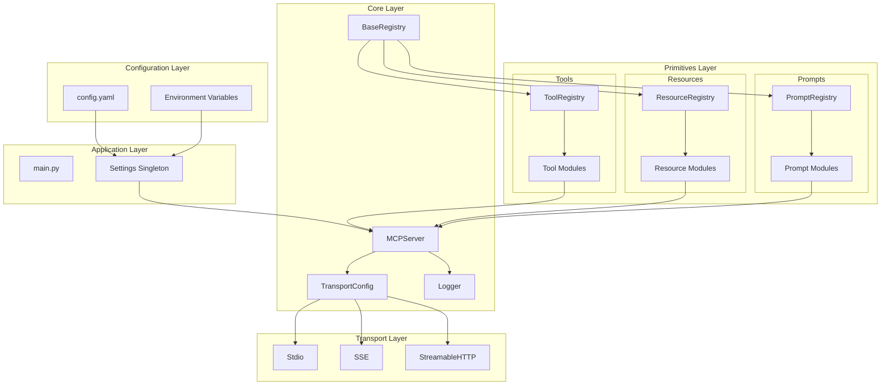
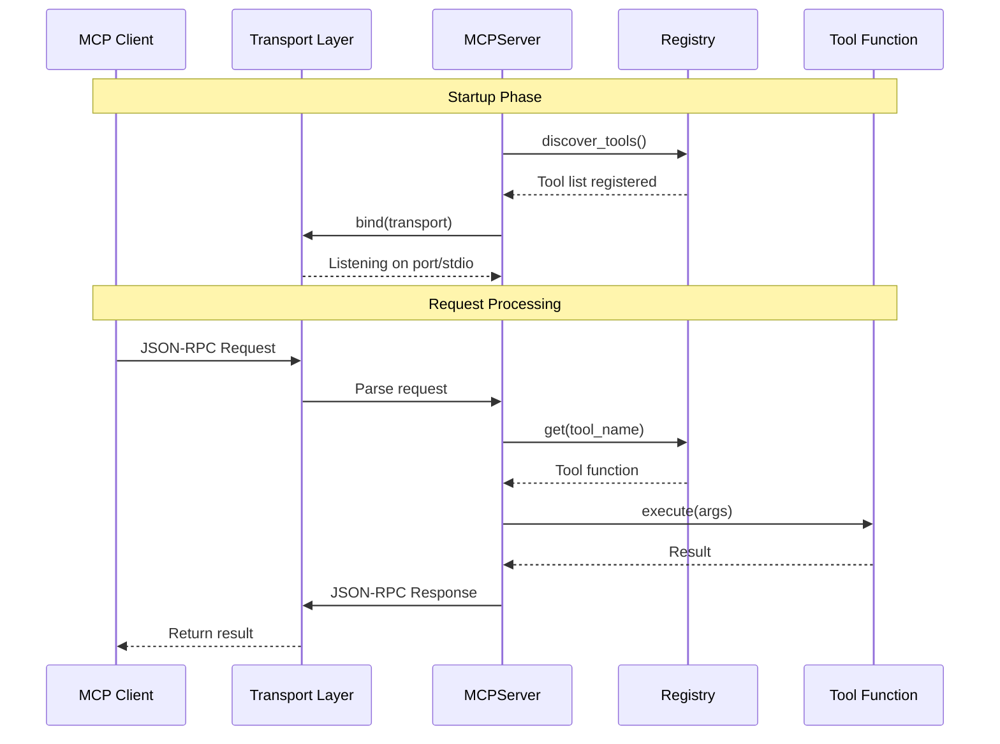
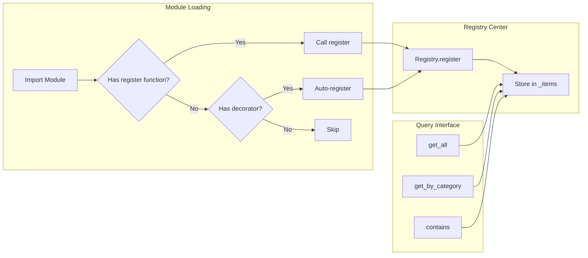

# QiuChi

> 君问归期未有期，巴山夜雨涨秋池。
> —— [唐] 李商隐《夜雨寄北》

QiuChi is an **enterprise-grade MCP (Model Context Protocol) server framework** built on FastMCP.

The name "QiuChi" comes from Li Shangyin's poem *Night Rain Sent North*: "君问归期未有期，巴山夜雨涨秋池。"

### Core Features

- **MCP Protocol Compliant**: Implements Tools, Resources, and Prompts primitives
- **Modular Design**: Separated by primitives following MCP decoupling principles
- **Plugin Registry System**: Decorator-based registration, auto-discovery, category management
- **Multiple Transports**: Switch between Stdio/SSE/HTTP via configuration
- **Dynamic Discovery**: Supports tools/list, resources/list, prompts/list
- **stderr Logging**: Ensures stdout contains only JSON-RPC messages
- **Full Type Hints**: All functions include Type Hints and Docstrings

## Project Structure

```
QiuChi/
├── src/                        # Enterprise MCP Framework
│   ├── __init__.py             # Package entry
│   ├── main.py                 # Application entry
│   ├── core/                   # Core modules
│   │   ├── config.py           # Configuration management
│   │   ├── server.py           # MCPServer wrapper
│   │   ├── transport.py        # Transport abstraction
│   │   ├── registry.py         # Base registry class
│   │   └── logger.py           # stderr logging
│   │
│   ├── tools/                  # Tools primitive (executable functions)
│   │   ├── base.py             # Tool registry system
│   │   ├── calculator.py       # Calculator tools
│   │   └── weather.py          # Weather tools
│   │
│   ├── resources/              # Resources primitive (data resources)
│   │   ├── base.py             # Resource registry system
│   │   └── knowledge.py        # Knowledge base resources
│   │
│   └── prompts/                # Prompts primitive (prompt templates)
│       ├── base.py             # Prompt registry system
│       └── templates.py        # Prompt templates
│
├── examples/                   # Example code
│   ├── mcp_clients/
│   └── mcp_servers/
│
├── config.yaml                 # Configuration file
└── pyproject.toml              # Project configuration
```

## Architecture

### Project Architecture



### Core Flow



### Registration Flow



## Requirements

- Python 3.11+
- uv package manager

## Quick Start

### 1. Install Dependencies

```bash
uv sync
```

### 2. Start Server

```bash
# HTTP mode (default)
PYTHONPATH=src uv run python src/main.py

# Stdio mode (Claude Desktop compatible)
MCP_TRANSPORT=stdio PYTHONPATH=src uv run python src/main.py

# Custom port
MCP_PORT=8080 PYTHONPATH=src uv run python src/main.py
```

### 3. Client Integration

#### HTTP Native

```python
import httpx

# Get Session ID
resp = httpx.get("http://localhost:8000/mcp",
                 headers={"Accept": "text/event-stream"})
session_id = resp.headers.get("mcp-session-id")

# Call tool
resp = httpx.post(
    "http://localhost:8000/mcp",
    json={"jsonrpc": "2.0", "method": "tools/call",
          "params": {"name": "add", "arguments": {"a": 10, "b": 20}},
          "id": 1},
    headers={"Content-Type": "application/json",
             "mcp-session-id": session_id}
)
print(resp.json())  # {"result": {"content": [{"text": "30.0"}]}}
```

#### LangChain/LangGraph

```python
from langchain_mcp_adapters.client import MultiServerMCPClient
from langchain.chat_models import init_chat_model
from langgraph.prebuilt import create_react_agent

# Create client
client = MultiServerMCPClient({
    "qiuchi_mcp": {
        "transport": "http",
        "url": "http://localhost:8000/mcp",
    }
})

# Get MCP tools and create Agent
tools = await client.get_tools()
model = init_chat_model("openai:gpt-4o-mini")
agent = create_react_agent(model, tools)

# Execute query
response = await agent.ainvoke({"messages": "Calculate 123 + 456"})
print(response['messages'][-1].content)
```

## Containerization Deployment

QiuChi (秋池) supports Docker containerization for easy deployment in production or isolated environments.

### Docker Image Build

```bash
# Build the image
docker build -t qiuchi-mcp:latest .

# Run container (map port 8000)
docker run -d --name qiuchi-mcp \
  -p 8000:8000 \
  -e OPENWEATHER_API_KEY=your_api_key_here \
  qiuchi-mcp:latest
```

### Docker Compose Deployment

Using Docker Compose makes it easier to manage service configuration and log persistence.

```bash
# Copy environment variable example file
cp .env.example .env
# Edit .env file with actual configuration

# Start service
docker-compose up -d

# View logs
docker-compose logs -f qiuchi-mcp

# Stop service
docker-compose down
```

### Environment Variables Configuration

The container supports overriding all configuration parameters via environment variables. See [.env.example](.env.example) for details. Main environment variables include:

| Variable | Description | Default |
|----------|-------------|---------|
| MCP_SERVER_NAME | Server name | QiuChi |
| MCP_VERSION | Server version | 1.0.0 |
| MCP_TRANSPORT | Transport type | streamable-http |
| MCP_HOST | HTTP listen address | 0.0.0.0 |
| MCP_PORT | HTTP listen port | 8000 |
| MCP_LOG_LEVEL | Log level | INFO |
| MCP_LOG_OUTPUT | Log output target | both |
| OPENWEATHER_API_KEY | OpenWeatherMap API key | - |

### Health Check

The container includes a built-in health check. You can verify service status with:

```bash
# Check container health status
docker inspect --format='{{.State.Health.Status}}' qiuchi-mcp

# Directly access health endpoint
curl -f http://localhost:8000/mcp
```

### Log Persistence

By default, logs are output to both stderr and files. When using Docker Compose, log files are persisted to the named volume `qiuchi-logs`.

```bash
# Check log file location
docker volume inspect qiuchi-logs

# Export logs
docker cp qiuchi-mcp:/app/logs ./logs
```

## Built-in Features

### Tools (9)

| Tool | Description |
|------|-------------|
| add | Add two numbers |
| subtract | Subtract two numbers |
| multiply | Multiply two numbers |
| divide | Divide two numbers |
| power | Power operation |
| sqrt | Square root |
| get_weather | Weather query |
| celsius_to_fahrenheit | Celsius to Fahrenheit |
| fahrenheit_to_celsius | Fahrenheit to Celsius |

### Resources (3)

| Resource URI | Description |
|--------------|-------------|
| knowledge://docs | API documentation |
| knowledge://config | Server configuration |
| knowledge://version | Version information |

### Prompts (5)

| Prompt | Description |
|--------|-------------|
| greeting | Personalized greeting |
| code_review | Code review prompt |
| weather_outfit_advice | Weather outfit advice |
| explain_concept | Concept explanation prompt |
| summarize_document | Document summary prompt |

## Configuration

### config.yaml

```yaml
mcp:
  server_name: "QiuChi"
  version: "1.0.0"
  transport: "streamable-http"  # stdio, sse, streamable-http
  host: "0.0.0.0"
  port: 8000

logging:
  level: "INFO"
  output: "both"  # stderr for MCP; also write under project-root logs/

features:
  tools: true
  resources: true
  prompts: true
```

### Environment Variables

| Variable | Description |
|----------|-------------|
| MCP_TRANSPORT | Transport type (stdio/sse/streamable-http) |
| MCP_PORT | HTTP listen port |
| MCP_LOG_LEVEL | Log level |
| OPENWEATHER_API_KEY | Weather API key |

## Extension Development

### Adding a New Tool

**Method 1: Decorator Registration (Recommended)**

```python
# src/tools/my_tool.py
from tools import register_tool

@register_tool(category="custom", subcategory="example")
def my_function(param: str) -> str:
    """
    Tool description.

    Args:
        param: Parameter description

    Returns:
        Result description
    """
    return f"Result: {param}"
```

**Method 2: Server Registration**

```python
# src/tools/my_tool.py
from typing import TYPE_CHECKING

if TYPE_CHECKING:
    from core.server import MCPServer

def register(server: "MCPServer") -> None:
    @server.tool
    def my_function(param: str) -> str:
        """
        Tool description.

        Args:
            param: Parameter description

        Returns:
            Result description
        """
        return f"Result: {param}"
```

### Adding a New Resource

```python
# src/resources/my_resource.py
from resources import register_resource

@register_resource(name="config://app", category="config")
def get_app_config() -> str:
    """Get application configuration."""
    return '{"version": "1.0.0"}'
```

### Adding a New Prompt

```python
# src/prompts/my_prompt.py
from prompts import register_prompt

@register_prompt(category="code")
def code_review(language: str) -> str:
    """Generate a code review prompt."""
    return f"Review this {language} code for best practices."
```

### Registry Query

```python
from tools import tool_registry, get_tools_by_category
from resources import resource_registry, get_all_resources
from prompts import prompt_registry, get_all_prompts

# Get all tools
all_tools = tool_registry.get_all()

# Get by category
math_tools = get_tools_by_category("math")

# Get by subcategory
qiuchi_tools = tool_registry.get_all(category="mcp", subcategory="qiuchi_mcp")

# Print registry info
tool_registry.print_info()
```

## MCP Inspector Validation

```bash
# Install MCP Inspector
npx @anthropic-ai/mcp-inspector

# Validate HTTP mode
# Connect to http://localhost:8000/mcp

# Validate Stdio mode
# Command: PYTHONPATH=src uv run python src/main.py
```

## License

MIT License
