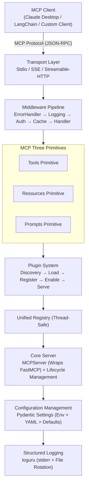
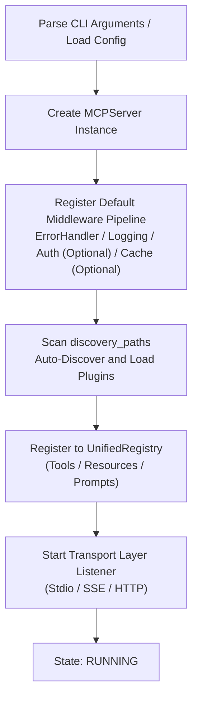
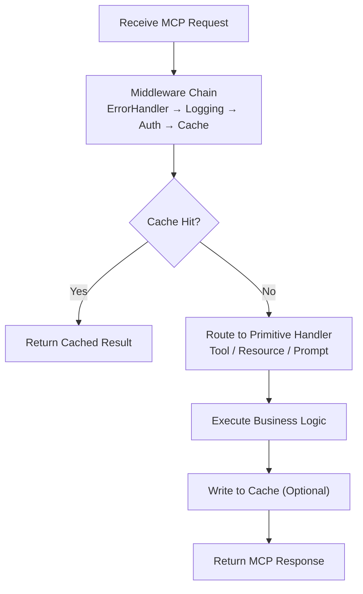
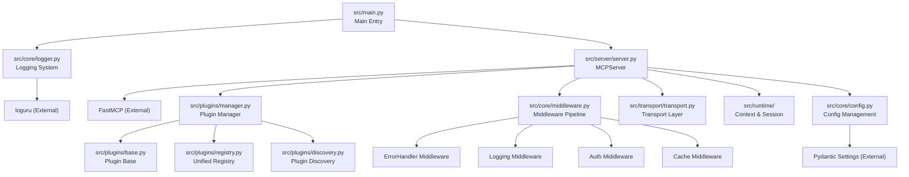

# QiuChi

[中文](README.md) | English

---

## Project Introduction

**QiuChi** is a **production-grade MCP (Model Context Protocol) server framework** built on [FastMCP](https://github.com/modelcontextprotocol/python-sdk). It delivers an out-of-the-box MCP server development experience for enterprises through a six-layer architecture, plugin-based design, middleware pipeline, and unified configuration management.

**Core Value**:

- **Protocol Compliant** — Full implementation of MCP protocol's three primitives: Tools, Resources, and Prompts
- **Clean Architecture** — Six distinct layers: Core / Plugins / Runtime / Transport / Utils / Examples
- **Out of the Box** — One-line decorator registration, automatic plugin discovery, plug-and-play middleware
- **Production Ready** — Structured logging, health checks, containerized deployment, TLS support

**Use Cases**:

- Rapidly building MCP tool services for LLM applications (Claude, GPT, etc.)
- Building enterprise-grade AI Agent toolchain platforms
- MCP services requiring flexible switching between multiple transports (Stdio / SSE / HTTP)
- AI infrastructure requiring plugin-based extensibility and middleware governance

---

## Quick Start

### 1. Requirements

| Dependency | Minimum Version | Description |
|------------|----------------|-------------|
| Python | >= 3.11 | Required for type hints, exception groups, and other features |
| uv | >= 0.1 | Recommended package manager ([Installation Guide](https://docs.astral.sh/uv/getting-started/installation/)) |
| Git | >= 2.0 | Repository cloning |

**Windows**:

```powershell
# Install uv (PowerShell)
powershell -ExecutionPolicy ByPass -c "irm https://astral.sh/uv/install.ps1 | iex"

# Or install via pip
pip install uv
```

**Linux**:

```bash
# Install uv
curl -LsSf https://astral.sh/uv/install.sh | sh

# Or install via pip
pip install uv
```

**macOS**:

```bash
# Install via Homebrew
brew install uv

# Or use the official installer
curl -LsSf https://astral.sh/uv/install.sh | sh

# Or install via pip
pip install uv
```

### 2. Clone the Repository

```bash
git clone https://github.com/chain-engine/x-QiuChi.git
cd x-QiuChi
```

### 3. Install Dependencies

```bash
# Sync dependencies with uv (recommended)
uv sync

# Development mode (includes testing, formatting, type checking tools)
uv sync --extra dev
```

### 4. Environment Configuration

```bash
# Copy the configuration file
cp config.yaml.example config.yaml
```

**Core Configuration Options** (`config.yaml`):

| Option | Default | Description |
|--------|---------|-------------|
| `mcp.server_name` | `QiuChi` | MCP server name |
| `mcp.version` | `1.0.0` | Server version |
| `mcp.transport` | `streamable-http` | Transport type: `stdio` / `sse` / `streamable-http` |
| `mcp.host` | `0.0.0.0` | HTTP listen address |
| `mcp.port` | `8000` | HTTP listen port |
| `mcp.json_response` | `true` | Enable JSON response mode |
| `logging.level` | `INFO` | Log level: `DEBUG` / `INFO` / `WARNING` / `ERROR` / `CRITICAL` |
| `logging.output` | `both` | Log output target: `stderr` / `file` / `both` |
| `logging.file_path` | `logs/x-QiuChi_{time}.log` | Log file path (supports time templates) |
| `logging.rotation` | `1 hour` | Log rotation period |
| `logging.retention` | `7 days` | Log retention duration |
| `features.tools` | `true` | Enable Tools primitive |
| `features.resources` | `true` | Enable Resources primitive |
| `features.prompts` | `true` | Enable Prompts primitive |
| `features.middleware` | `true` | Enable middleware pipeline |
| `features.cache` | `false` | Enable cache middleware |
| `plugins.auto_discovery` | `true` | Enable automatic plugin discovery |
| `plugins.discovery_paths` | `["src.plugins", "src.examples"]` | Plugin scan paths |
| `middleware.auth.enabled` | `false` | Enable token authentication |
| `middleware.cache.enabled` | `false` | Enable in-memory cache |
| `middleware.cache.default_ttl` | `300` | Cache default TTL (seconds) |

**Environment Variable Override**: All configuration can be overridden via environment variables. Priority: **Environment Variables > YAML > Defaults**. Common environment variables:

| Variable | Description |
|----------|-------------|
| `MCP_SERVER_NAME` | Server name |
| `MCP_TRANSPORT` | Transport type |
| `MCP_HOST` | Listen address |
| `MCP_PORT` | Listen port |
| `MCP_LOG_LEVEL` | Log level |
| `MCP_LOG_OUTPUT` | Log output target |

### 5. Start the Server

#### Local Development with Hot Reload

```bash
# HTTP mode (default, port 8000)
uv run python src/main.py

# Using the project script entry
uv run x-QiuChi

# Stdio mode (compatible with Claude Desktop)
uv run python src/main.py --transport stdio

# Custom parameters
uv run python src/main.py --host 127.0.0.1 --port 8080 --log-level DEBUG

# View all startup parameters
uv run python src/main.py --help
```

#### Docker Container Deployment

```bash
# Build image and start container
docker compose up -d

# View runtime logs
docker compose logs -f qiuchi-mcp

# Start with custom environment variables
MCP_PORT=9000 MCP_LOG_LEVEL=DEBUG docker compose up -d

# Stop and remove container
docker compose down
```

**Docker Environment Variables**:

| Variable | Default | Description |
|----------|---------|-------------|
| `MCP_SERVER_NAME` | `QiuChi` | Server name |
| `MCP_TRANSPORT` | `streamable-http` | Transport type |
| `MCP_HOST` | `0.0.0.0` | Listen address |
| `MCP_PORT` | `8000` | Listen port |
| `MCP_LOG_LEVEL` | `INFO` | Log level |
| `MCP_LOG_OUTPUT` | `both` | Log output target |
| `OPENWEATHER_API_KEY` | - | OpenWeatherMap API key (optional) |

**Health Check**: The container includes a built-in health check mechanism (every 30 seconds by default):

```bash
# Check container health status
docker inspect --format='{{.State.Health.Status}}' qiuchi-mcp

# Directly access the health endpoint
curl -f http://localhost:8000/mcp
```

### 6. Common Engineering Commands

```bash
# Run all tests
uv run pytest

# Run specific test file (verbose output)
uv run pytest tests/test_integration.py -v

# Test coverage report
uv run pytest --cov=src tests/

# Code formatting
uv run ruff format src/

# Static code analysis
uv run ruff check src/

# Auto-fix fixable lint issues
uv run ruff check --fix src/

# Type checking
uv run mypy src/

# MCP Inspector validation
npx @anthropic-ai/mcp-inspector
# Connect to: http://localhost:8000/mcp
```

### 7. Usage Examples

#### Register Tools with Decorators

```python
from main import create_server, tool, resource, prompt

server = create_server("MyServer")

# Register a tool
@tool(category="math")
def add(a: float, b: float) -> float:
    """Add two numbers."""
    return a + b

# Register a resource
@resource(name="config://app", category="config")
def get_app_config() -> str:
    """Get application configuration."""
    return '{"version": "1.0.0"}'

# Register a prompt
@prompt(category="code")
def code_review(language: str) -> str:
    """Generate a code review prompt."""
    return f"Please review this {language} code for best practices."

server.run()
```

#### HTTP Client Calls

```python
import httpx

# Get Session ID
resp = httpx.get("http://localhost:8000/mcp",
                 headers={"Accept": "text/event-stream"})
session_id = resp.headers.get("mcp-session-id")

# Call a tool
resp = httpx.post(
    "http://localhost:8000/mcp",
    json={"jsonrpc": "2.0", "method": "tools/call",
          "params": {"name": "add", "arguments": {"a": 10, "b": 20}},
          "id": 1},
    headers={"Content-Type": "application/json",
             "mcp-session-id": session_id}
)
print(resp.json())  # {"result": {"content": [{"text": "30.0"}]}}
```

#### LangChain / LangGraph Integration

```python
from langchain_mcp_adapters.client import MultiServerMCPClient
from langchain.chat_models import init_chat_model
from langgraph.prebuilt import create_react_agent

client = MultiServerMCPClient({
    "qiuchi_mcp": {
        "transport": "http",
        "url": "http://localhost:8000/mcp",
    }
})

tools = await client.get_tools()
model = init_chat_model("openai:gpt-4o-mini")
agent = create_react_agent(model, tools)

response = await agent.ainvoke({"messages": "Calculate 123 + 456"})
print(response['messages'][-1].content)
```

---

## Project Structure

```
x-QiuChi/
├── config.yaml                      # Runtime configuration file
├── config.yaml.example              # Configuration example (all fields documented)
├── pyproject.toml                   # Package config, dependencies, toolchain settings
├── Dockerfile                       # Multi-stage build image definition
├── docker-compose.yml               # Container orchestration config
├── LICENSE                          # MIT open source license
│
├── src/                             # Source root directory
│   ├── main.py                      # Main entry: CLI argument parsing and server startup
│   │
│   ├── constants/                   # Constants layer
│   │   ├── base.py                  # Base constants
│   │   ├── constants.py             # Business constants
│   │   └── enums.py                 # Enum type definitions
│   │
│   ├── core/                        # Core layer: framework infrastructure
│   │   ├── config.py                # Pydantic Settings config management (multi-source priority, hot reload)
│   │   ├── exceptions.py            # Custom exception hierarchy
│   │   ├── logger.py                # loguru structured logging (file rotation, sensitive info filtering)
│   │   └── middleware.py            # Middleware pipeline (ErrorHandler / Logging / Auth / Cache)
│   │
│   ├── plugins/                     # Plugin layer: plugin system core
│   │   ├── base.py                  # Plugin abstract base class and metadata (PluginType / PluginMetadata)
│   │   ├── registry.py              # UnifiedRegistry (thread-safe)
│   │   ├── manager.py               # PluginManager (auto-discovery, dependency resolution, lifecycle)
│   │   ├── discovery.py             # Plugin discovery scanner
│   │   ├── loader.py                # Plugin loader
│   │   └── collector.py             # Plugin collector (decorator registration entry)
│   │
│   ├── server/                      # Server layer: MCP server core
│   │   ├── server.py                # MCPServer class (wraps FastMCP, decorator registration, middleware)
│   │   └── lifecycle.py             # Server lifecycle state machine (UNINITIALIZED → RUNNING → STOPPED)
│   │
│   ├── runtime/                     # Runtime layer: request context and session management
│   │   ├── context.py               # RequestContext
│   │   └── session.py               # SessionManager
│   │
│   ├── transport/                   # Transport layer: multi-protocol transport abstraction
│   │   └── transport.py             # Transport config (Stdio / SSE / Streamable-HTTP / TLS)
│   │
│   ├── utils/                       # Utils layer: general-purpose helper functions
│   │   └── helpers.py               # Utility function collection
│   │
│   └── examples/                    # Examples layer: built-in example plugins
│       ├── tools/
│       │   └── math.py              # 8 math tools (add, subtract, multiply, divide, power, sqrt, temperature)
│       ├── resources/
│       │   └── config.py            # 3 config resources (server config / version / API docs)
│       └── prompts/
│           └── templates.py         # 5 prompt templates (greeting, code review, weather outfit, etc.)
│
├── examples/                        # External example code
│   ├── mcp_clients/
│   │   ├── mcp_client.py            # Native JSON-RPC MCP client example
│   │   └── langchain_mcp_client.py  # LangChain MCP integration example
│   └── mcp_servers/
│       └── weather_mcp_server.py    # OpenWeatherMap MCP service example
│
├── tests/                           # Test directory
│   └── test_integration.py          # 7-step integration test suite
│
├── docs/                            # Documentation directory
├── scripts/                         # Script tools directory
├── static/                          # Static assets directory
├── logs/                            # Log output directory (generated at runtime)
└── tmp/                             # Temporary files directory
```

---

## System Architecture

### System Layered Architecture


```mermaid
flowchart TD
    A["MCP Client<br/>(Claude Desktop / LangChain / Custom Client)"]
    B["Transport Layer<br/>Stdio / SSE / Streamable-HTTP"]
    C["Middleware Pipeline<br/>ErrorHandler → Logging → Auth → Cache → Handler"]
    subgraph D["MCP Three Primitives"]
        direction LR
        D1["Tools Primitive"]
        D2["Resources Primitive"]
        D3["Prompts Primitive"]
    end
    E["Plugin System<br/>Discovery → Load → Register → Enable → Serve"]
    F["Unified Registry (Thread-Safe)"]
    G["Core Server<br/>MCPServer (Wraps FastMCP) + Lifecycle Management"]
    H["Configuration Management<br/>Pydantic Settings (Env > YAML > Defaults)"]
    I["Structured Logging<br/>loguru (stderr + File Rotation)"]

    A -->|"MCP Protocol (JSON-RPC)"| B
    B --> C
    C --> D
    D --> E
    E --> F
    F --> G
    G --> H
    H --> I
```

### Server Startup Flow


```mermaid
flowchart TD
    S1["Parse CLI Arguments / Load Config"] --> S2["Create MCPServer Instance"]
    S2 --> S3["Register Default Middleware Pipeline<br/>ErrorHandler / Logging / Auth (Optional) / Cache (Optional)"]
    S3 --> S4["Scan discovery_paths<br/>Auto-Discover and Load Plugins"]
    S4 --> S5["Register to UnifiedRegistry<br/>(Tools / Resources / Prompts)"]
    S5 --> S6["Start Transport Layer Listener<br/>(Stdio / SSE / HTTP)"]
    S6 --> S7["State: RUNNING"]
```

### Request Processing Flow


```mermaid
flowchart TD
    R1["Receive MCP Request"] --> R2["Middleware Chain<br/>ErrorHandler → Logging → Auth → Cache"]
    R2 --> R3{"Cache Hit?"}
    R3 -->|"Yes"| R8["Return Cached Result"]
    R3 -->|"No"| R4["Route to Primitive Handler<br/>Tool / Resource / Prompt"]
    R4 --> R5["Execute Business Logic"]
    R5 --> R6["Write to Cache (Optional)"]
    R6 --> R7["Return MCP Response"]
```

### Module Dependency Graph


```mermaid
flowchart TD
    A["src/main.py<br/>Main Entry"] --> B["src/server/server.py<br/>MCPServer"]
    A --> K["src/core/logger.py<br/>Logging System"]
    K --> K1["loguru (External)"]

    B --> C1["FastMCP (External)"]
    B --> D["src/plugins/manager.py<br/>Plugin Manager"]
    B --> E["src/core/middleware.py<br/>Middleware Pipeline"]
    B --> F["src/transport/transport.py<br/>Transport Layer"]

    D --> D1["src/plugins/base.py<br/>Plugin Base"]
    D --> D2["src/plugins/registry.py<br/>Unified Registry"]
    D --> D3["src/plugins/discovery.py<br/>Plugin Discovery"]

    E --> E1["ErrorHandler Middleware"]
    E --> E2["Logging Middleware"]
    E --> E3["Auth Middleware"]
    E --> E4["Cache Middleware"]

    B --> G["src/runtime/<br/>Context & Session"]
    B --> H["src/core/config.py<br/>Config Management"]
    H --> H1["Pydantic Settings (External)"]
```

---

## Tech Stack

| Category | Technology | Version | Description |
|----------|-----------|---------|-------------|
| **Language** | [Python](https://www.python.org/) | >= 3.11 | Primary development language |
| **MCP Framework** | [FastMCP (mcp)](https://github.com/modelcontextprotocol/python-sdk) | >= 1.0.0 | MCP protocol Python SDK, server core |
| **Data Validation** | [Pydantic](https://docs.pydantic.dev/) / pydantic-settings | >= 2.0.0 | Type-safe config management and data validation |
| **HTTP Client** | [httpx](https://www.python-httpx.org/) | >= 0.27.0 | Async HTTP client |
| **HTTP Utility** | [Requests](https://requests.readthedocs.io/) | >= 2.28.0 | Synchronous HTTP request library |
| **Config Parsing** | [PyYAML](https://pyyaml.org/) | >= 6.0 | YAML config file parsing |
| **Logging** | [loguru](https://loguru.readthedocs.io/) | >= 0.7.0 | Structured logging, file rotation, sensitive info filtering |
| **Code Quality** | [Ruff](https://docs.astral.sh/ruff/) | >= 0.6.0 | Code formatting + Linting (replaces Black + Flake8) |
| **Type Checking** | [Mypy](https://mypy.readthedocs.io/) | >= 1.0.0 | Static type checking (strict mode) |
| **Testing** | [Pytest](https://docs.pytest.org/) + pytest-asyncio | >= 8.0.0 | Unit testing and async testing |
| **Package Manager** | [uv](https://docs.astral.sh/uv/) | >= 0.1 | High-performance Python package manager |
| **Containerization** | [Docker](https://www.docker.com/) / Docker Compose | - | Multi-stage build, non-root user, health checks |
| **Build Backend** | [Hatchling](https://hatch.pypa.io/) | - | PEP 517 build backend |

---

## API Documentation

QiuChi, as an MCP server framework, does not provide traditional REST APIs. Instead, it uses the **MCP protocol** for capability discovery and interaction.

### MCP Protocol Interface List

| Capability | MCP Method | Description |
|-----------|-----------|-------------|
| Tool List | `tools/list` | Get all registered tools with their parameter definitions |
| Tool Call | `tools/call` | Call a specified tool and return execution results |
| Resource List | `resources/list` | Get all registered resources with their URIs |
| Resource Read | `resources/read` | Read the content of a specified URI resource |
| Prompt List | `prompts/list` | Get all registered prompt templates |
| Prompt Get | `prompts/get` | Get a specified prompt template with its parameters |

### Built-in Examples

**Tools (8)**:

| Tool Name | Description |
|-----------|-------------|
| `add` | Add two numbers |
| `subtract` | Subtract two numbers |
| `multiply` | Multiply two numbers |
| `divide` | Divide two numbers |
| `power` | Power operation |
| `sqrt` | Square root |
| `celsius_to_fahrenheit` | Celsius to Fahrenheit |
| `fahrenheit_to_celsius` | Fahrenheit to Celsius |

**Resources (3)**:

| Resource URI | Description |
|--------------|-------------|
| `config://server` | Server configuration info |
| `config://version` | Version information |
| `docs://api` | API documentation |

**Prompts (5)**:

| Prompt Name | Description |
|-------------|-------------|
| `greeting` | Personalized greeting |
| `code_review` | Code review prompt |
| `weather_outfit_advice` | Weather outfit advice |
| `explain_concept` | Concept explanation prompt |
| `summarize_document` | Document summary prompt |

---

## Storage Configuration

### In-Memory Storage

| Storage Type | Implementation | Config Location | Description |
|-------------|---------------|-----------------|-------------|
| Session Storage | In-memory dict | `src/runtime/session.py` | SessionManager with TTL and auto-cleanup |
| Cache Storage | In-memory dict | `src/core/middleware.py` | CacheMiddleware with TTL, SHA-256 key generation |
| Plugin Registry | In-memory dict | `src/plugins/registry.py` | UnifiedRegistry, thread-safe (RLock) |

### Log File Storage

| Config Option | Default | Description |
|---------------|---------|-------------|
| `logging.file_path` | `logs/x-QiuChi_{time:YYYY-MM-DD-HH}.log` | Log file path (supports time template variables) |
| `logging.rotation` | `1 hour` | Log rotation period |
| `logging.retention` | `7 days` | Log retention duration |
| `logging.output` | `both` | Output target: `stderr` (stderr only) / `file` (file only) / `both` (both) |

> **Extension Note**: The cache middleware defines an abstract backend interface that can be extended to external storage backends like Redis. The current version does not include object storage integration, but extension interfaces are reserved for future use.

---

## License

This project is licensed under the [MIT](LICENSE) License.

---

## References

| Resource | Link |
|----------|------|
| MCP Protocol Specification | https://modelcontextprotocol.io/ |
| FastMCP SDK | https://github.com/modelcontextprotocol/python-sdk |
| Python Official Documentation | https://docs.python.org/3.11/ |
| Pydantic Documentation | https://docs.pydantic.dev/ |
| Pydantic Settings Documentation | https://docs.pydantic.dev/latest/concepts/pydantic_settings/ |
| uv Package Manager | https://docs.astral.sh/uv/ |
| loguru Logging Library | https://loguru.readthedocs.io/ |
| httpx Documentation | https://www.python-httpx.org/ |
| PyYAML Documentation | https://pyyaml.org/wiki/PyYAMLDocumentation |
| Ruff Documentation | https://docs.astral.sh/ruff/ |
| Mypy Documentation | https://mypy.readthedocs.io/ |
| Pytest Documentation | https://docs.pytest.org/ |
| Docker Official Documentation | https://docs.docker.com/ |
| Hatchling Documentation | https://hatch.pypa.io/ |

---

## Contact

| Channel | Information |
|---------|-------------|
| Author | John Young |
| Email | [john.young@foxmail.com](mailto:john.young@foxmail.com) |
| Gitee | https://gitee.com/yeyushilai |
| GitHub | https://github.com/yeyushilai |
| Project | https://github.com/chain-engine/x-QiuChi |
