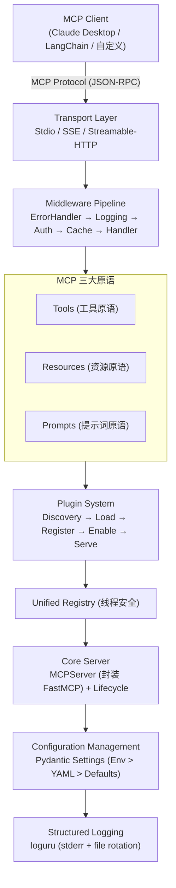
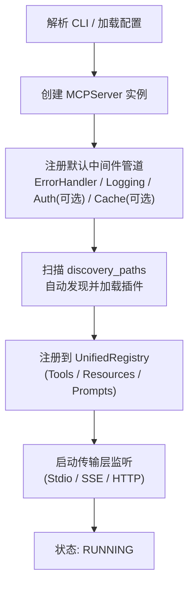
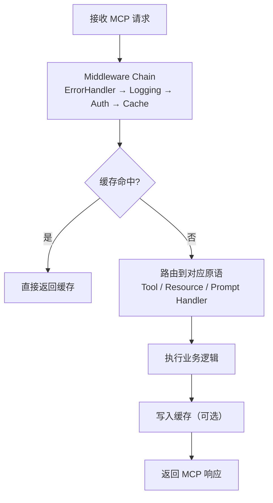
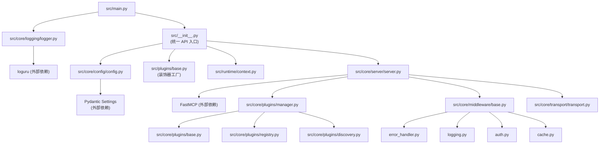

# 秋池（QiuChi）

[](https://www.python.org/downloads/)
[](LICENSE)
[](https://github.com/astral-sh/ruff)

> 君问归期未有期，巴山夜雨涨秋池。
> —— [唐] 李商隐《夜雨寄北》

---

## 项目简介

**秋池（QiuChi）** 是一个**生产级 MCP (Model Context Protocol) 服务器框架**，基于 [FastMCP](https://github.com/modelcontextprotocol/python-sdk) 构建。通过六层清晰架构、插件化设计、中间件管道和统一配置管理，为企业提供开箱即用的 MCP 服务器开发体验。

**核心价值**：将 MCP 协议的服务器端开发从"手写脚手架"升级为"声明式开发"——用装饰器注册工具/资源/提示词，用配置文件管理一切。

**适用场景**：

- 为 LLM 应用（Claude、GPT 等）快速搭建 MCP 工具服务
- 构建企业级 AI Agent 工具链平台
- 需要多传输层（Stdio / SSE / HTTP）灵活切换的 MCP 服务
- 需要插件化扩展和中间件治理的 AI 基础设施

---

## 核心特征

- **六层清晰架构** —— Core / Plugins / Runtime / Utils / CLI / Examples，职责分明
- **插件化系统** —— 统一注册表、自动发现、完整生命周期管理（load → enable → disable → unload）、依赖解析
- **中间件管道** —— ErrorHandler / Logging / Auth / Cache，可组合、可扩展
- **增强配置** —— Pydantic 类型安全，环境变量 > YAML > 默认值三级优先，支持热重载
- **MCP 三大原语** —— 完整实现 Tools、Resources、Prompts，装饰器一键注册
- **多传输层** —— Stdio / SSE / Streamable-HTTP 可配置切换
- **结构化日志** —— 基于 loguru，支持文件轮转与敏感信息过滤
- **容器化部署** —— 提供 Dockerfile + docker-compose，开箱即用

---

## 项目结构

```
x-QiuChi/
├── config.yaml                      # 运行时配置文件
├── config.yaml.example              # 配置示例（含全部字段说明）
├── .env.example                     # 环境变量示例
├── pyproject.toml                   # 包配置、依赖、工具链设置
├── Dockerfile                       # 多阶段构建镜像
├── docker-compose.yml               # 容器编排
├── LICENSE                          # MIT 许可证
│
├── src/                             # 源码目录
│   ├── __init__.py                  # 统一 API 入口（create_server, tool, resource, prompt）
│   ├── main.py                      # 主入口，CLI 参数解析与服务器启动
│   │
│   ├── core/                        # [核心层] 框架核心功能
│   │   ├── config/
│   │   │   └── config.py            # Pydantic Settings 配置管理（多源优先级、热重载）
│   │   ├── server/
│   │   │   ├── server.py            # MCPServer（封装 FastMCP，装饰器注册，中间件集成）
│   │   │   └── lifecycle.py         # 服务器状态机（UNINITIALIZED → RUNNING → STOPPED）
│   │   ├── plugins/
│   │   │   ├── base.py              # 插件抽象基类（ToolPlugin / ResourcePlugin / PromptPlugin）
│   │   │   ├── registry.py          # UnifiedRegistry（线程安全统一注册表）
│   │   │   ├── manager.py           # PluginManager（自动发现、依赖解析、生命周期）
│   │   │   └── discovery.py         # 插件发现扫描器
│   │   ├── middleware/
│   │   │   ├── base.py              # Middleware ABC + MiddlewareChain 管道
│   │   │   ├── error_handler.py     # 统一错误处理（JSON-RPC 标准错误码）
│   │   │   ├── logging.py           # 请求/响应日志（敏感信息过滤）
│   │   │   ├── auth.py              # Token 认证 + 角色权限
│   │   │   └── cache.py             # 内存缓存（TTL、SHA-256 Key）
│   │   ├── transport/
│   │   │   └── transport.py         # 传输层配置（SSE / HTTP / TLS）
│   │   ├── logging/
│   │   │   └── logger.py            # loguru 封装（文件轮转、多输出）
│   │   └── types.py                 # 共享枚举（TransportType, LogLevel, LogOutput）
│   │
│   ├── plugins/                     # [插件层] 装饰器工厂
│   │   ├── base.py                  # PluginDecorator（生成 @tool / @resource / @prompt）
│   │   ├── tools/__init__.py        # 导出 tool 装饰器
│   │   ├── resources/__init__.py    # 导出 resource 装饰器
│   │   └── prompts/__init__.py      # 导出 prompt 装饰器
│   │
│   ├── runtime/                     # [运行时层] 请求上下文
│   │   └── context.py               # RequestContext + SessionManager + ContextManager
│   │
│   ├── utils/                       # [工具层] 通用工具（预留）
│   ├── cli/                         # [CLI 层] 命令行工具（预留）
│   │
│   └── examples/                    # [示例层] 内置示例插件
│       ├── tools/math.py            # 8 个数学工具（加减乘除、幂、开方、温度转换）
│       ├── resources/config.py      # 3 个配置资源（server config / version / API docs）
│       └── prompts/templates.py     # 5 个提示词模板（问候、代码审查、天气穿搭等）
│
├── examples/                        # 外部示例
│   ├── mcp_clients/
│   │   ├── mcp_client.py            # JSON-RPC MCP 客户端
│   │   └── langchain_mcp_client.py  # LangChain 集成示例
│   └── mcp_servers/
│       └── weather_mcp_server.py    # OpenWeatherMap 天气服务示例
│
├── tests/
│   └── test_integration.py          # 7 步集成测试套件
│
└── logs/                            # 日志输出目录
```

---

## 系统架构

### 系统分层架构图



### 核心功能业务流程图

**服务器启动流程**：



**请求处理流程**：



### 模块依赖关系图



---

## 快速开始

### 环境要求

| 项目 | 最低版本 | 说明 |
|------|---------|------|
| Python | >= 3.11 | 类型提示、异常组等特性要求 |
| uv | >= 0.1 | 推荐包管理器（[安装指南](https://docs.astral.sh/uv/getting-started/installation/)） |
| Git | >= 2.0 | 项目克隆 |

**Windows 环境额外说明**：

```powershell
# 安装 uv（PowerShell）
powershell -ExecutionPolicy ByPass -c "irm https://astral.sh/uv/install.ps1 | iex"

# 或使用 pip 安装
pip install uv
```

**Linux 环境额外说明**：

```bash
# 安装 uv
curl -LsSf https://astral.sh/uv/install.sh | sh

# 或使用 pip
pip install uv
```

### 项目克隆

```bash
git clone https://gitee.com/chain-engine/x-QiuChi.git
cd x-QiuChi
```

### 依赖安装

```bash
# 使用 uv（推荐）
uv sync

# 开发模式（包含测试、格式化、类型检查工具）
uv sync --extra dev

# 或使用 pip
pip install -e .
pip install -e ".[dev]"
```

### 配置文件创建

```bash
# 1. 复制配置文件
cp config.yaml.example config.yaml

# 2. 复制环境变量文件
cp .env.example .env
```

**核心配置项说明**（`config.yaml`）：

| 配置项 | 默认值 | 说明 |
|--------|--------|------|
| `mcp.server_name` | `QiuChi` | 服务器名称 |
| `mcp.transport` | `streamable-http` | 传输类型：`stdio` / `sse` / `streamable-http` |
| `mcp.host` | `0.0.0.0` | HTTP 监听地址 |
| `mcp.port` | `8000` | HTTP 监听端口 |
| `logging.level` | `INFO` | 日志级别 |
| `plugins.auto_discovery` | `true` | 是否自动发现插件 |

**环境变量覆盖**：所有配置均可通过环境变量覆盖，优先级为 **环境变量 > YAML > 默认值**。详见 [.env.example](.env.example)。

### 服务启动

#### 本地启动

```bash
# HTTP 模式（默认，端口 8000）
uv run python src/main.py
# 或使用项目名称
uv run x-QiuChi

# Stdio 模式（兼容 Claude Desktop）
uv run python src/main.py --transport stdio
# 或
uv run x-QiuChi --transport stdio

# 自定义参数
uv run python src/main.py --host 127.0.0.1 --port 8080 --log-level DEBUG
# 或
uv run x-QiuChi --host 127.0.0.1 --port 8080 --log-level DEBUG

# 查看全部参数
uv run python src/main.py --help
# 或
uv run x-QiuChi --help
```

#### Docker 启动

```bash
# 构建并启动
docker compose up -d

# 查看日志
docker compose logs -f qiuchi-mcp

# 自定义环境变量启动
MCP_PORT=9000 MCP_LOG_LEVEL=DEBUG docker compose up -d

# 停止服务
docker compose down
```

### 常用命令

```bash
# 运行测试
pytest

# 运行指定测试（详细输出）
pytest tests/test_integration.py -v

# 测试覆盖率
pytest --cov=src tests/

# 代码格式化
ruff format src/

# 代码检查
ruff check src/

# 类型检查
mypy src/
```

---

## 技术栈

| 分类 | 技术 | 版本 | 说明 |
|------|------|------|------|
| **MCP 框架** | [FastMCP](https://github.com/modelcontextprotocol/python-sdk) | >= 1.0.0 | MCP 协议 Python SDK，服务器核心 |
| **数据验证** | [Pydantic](https://docs.pydantic.dev/) / pydantic-settings | >= 2.0.0 | 类型安全配置管理与数据验证 |
| **日志** | [loguru](https://loguru.readthedocs.io/) | >= 0.7.0 | 结构化日志，文件轮转 |
| **HTTP 客户端** | [httpx](https://www.python-httpx.org/) | >= 0.27.0 | 异步 HTTP 客户端 |
| **配置解析** | [PyYAML](https://pyyaml.org/) | >= 6.0 | YAML 配置文件解析 |
| **代码质量** | [Ruff](https://docs.astral.sh/ruff/) | >= 0.6.0 | 代码格式化 + Lint（替代 Black + Flake8） |
| **类型检查** | [Mypy](https://mypy.readthedocs.io/) | >= 1.0.0 | 静态类型检查（strict 模式） |
| **测试** | [Pytest](https://docs.pytest.org/) | >= 8.0.0 | 测试框架 + pytest-asyncio |
| **包管理** | [uv](https://docs.astral.sh/uv/) | >= 0.1 | 快速 Python 包管理器 |
| **容器化** | [Docker](https://www.docker.com/) | - | 多阶段构建，非 root 用户运行 |

---

## API 文档

QiuChi 作为 MCP 服务器框架，不提供传统 REST API，而是通过 **MCP 协议** 进行能力发现与交互：

| 能力 | MCP 方法 | 说明 |
|------|---------|------|
| 工具列表 | `tools/list` | 获取所有已注册工具 |
| 工具调用 | `tools/call` | 调用指定工具 |
| 资源列表 | `resources/list` | 获取所有已注册资源 |
| 资源读取 | `resources/read` | 读取指定资源内容 |
| 提示词列表 | `prompts/list` | 获取所有已注册提示词 |
| 提示词获取 | `prompts/get` | 获取指定提示词内容 |

**内置示例**：

- **8 个工具**：`add`, `subtract`, `multiply`, `divide`, `power`, `sqrt`, `celsius_to_fahrenheit`, `fahrenheit_to_celsius`
- **3 个资源**：`config://server`, `config://version`, `docs://api`
- **5 个提示词**：`greeting`, `code_review`, `weather_outfit_advice`, `explain_concept`, `summarize_document`

---

## 存储配置

### 本地存储

| 存储类型 | 实现方式 | 配置位置 | 说明 |
|---------|---------|---------|------|
| 会话存储 | 内存字典 | `src/runtime/context.py` | SessionManager，支持 TTL 和自动清理 |
| 缓存存储 | 内存字典 | `src/core/middleware/cache.py` | MemoryCacheBackend，支持 TTL、SHA-256 Key |
| 插件注册表 | 内存字典 | `src/core/plugins/registry.py` | PluginRegistry，线程安全（RLock） |
| 日志文件 | 本地文件 | `config.yaml → logging.file_path` | 默认 `logs/qiuchi.log`，每日轮转，保留 7 天 |

> **扩展**：缓存中间件设计了 `CacheBackend` 抽象类，可扩展为 Redis 等外部存储后端。

### 对象存储

当前版本暂不提供对象存储集成，预留扩展接口。

---

## 许可证

本项目采用 [MIT](LICENSE) 许可证。

---

## 参考资料

| 资源 | 链接 |
|------|------|
| MCP 协议规范 | https://modelcontextprotocol.io/ |
| FastMCP SDK | https://github.com/modelcontextprotocol/python-sdk |
| Python 官方文档 | https://docs.python.org/3.11/ |
| Pydantic 文档 | https://docs.pydantic.dev/ |
| uv 包管理器 | https://docs.astral.sh/uv/ |
| loguru 日志库 | https://loguru.readthedocs.io/ |
| FastAPI 框架 | https://fastapi.tiangolo.com/ |

---

## 联系方式

| 渠道 | 信息 |
|------|------|
| 作者 | John Young |
| 邮箱 | [john.young@foxmail.com](mailto:john.young@foxmail.com) |
| Gitee | [https://gitee.com/yeyushilai](https://gitee.com/yeyushilai) |
| GitHub | [https://github.com/yeyushilai](https://github.com/yeyushilai) |
| 项目地址 | [https://gitee.com/chain-engine/x-QiuChi](https://gitee.com/chain-engine/x-QiuChi) |
