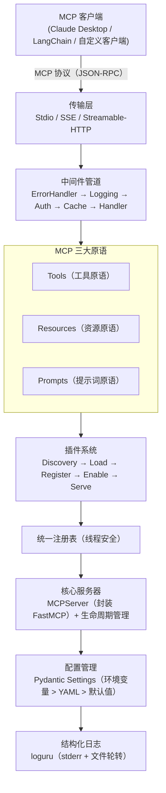
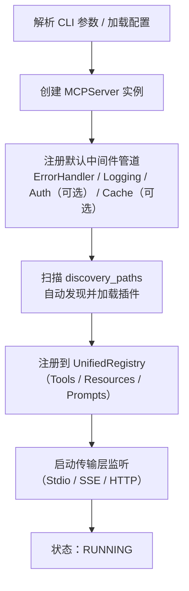
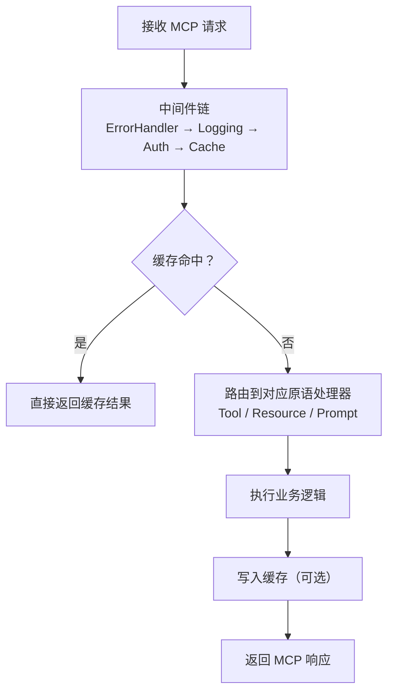
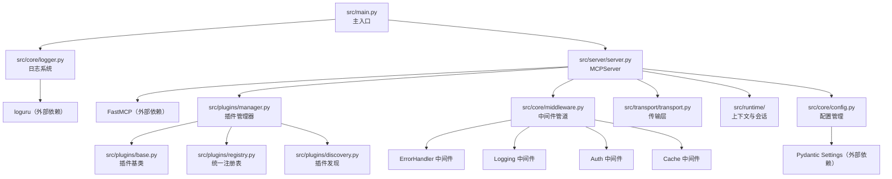

# 秋池（QiuChi）

[English](README.en.md) | 中文

---

## 项目简介

**秋池（QiuChi）** 是一个**生产级 MCP（Model Context Protocol）服务器框架**，基于 [FastMCP](https://github.com/modelcontextprotocol/python-sdk) 构建。通过六层清晰架构、插件化设计、中间件管道和统一配置管理，为企业提供开箱即用的 MCP 服务器开发体验。

**核心价值**：

- **协议合规** —— 完整实现 MCP 协议 Tools、Resources、Prompts 三大原语
- **架构清晰** —— Core / Plugins / Runtime / Transport / Utils / Examples 六层职责分明
- **开箱即用** —— 装饰器一键注册、插件自动发现、中间件即插即用
- **生产就绪** —— 结构化日志、健康检查、容器化部署、TLS 支持

**适配场景**：

- 为 LLM 应用（Claude、GPT 等）快速搭建 MCP 工具服务
- 构建企业级 AI Agent 工具链平台
- 需要多传输层（Stdio / SSE / HTTP）灵活切换的 MCP 服务
- 需要插件化扩展和中间件治理的 AI 基础设施

---

## 快速开始

### 1. 环境要求

| 依赖项 | 最低版本 | 说明 |
|--------|---------|------|
| Python | >= 3.11 | 类型提示、异常组等特性要求 |
| uv | >= 0.1 | 推荐包管理器（[安装指南](https://docs.astral.sh/uv/getting-started/installation/)） |
| Git | >= 2.0 | 项目克隆 |

**Windows 环境**：

```powershell
# 安装 uv（PowerShell）
powershell -ExecutionPolicy ByPass -c "irm https://astral.sh/uv/install.ps1 | iex"

# 或使用 pip 安装
pip install uv
```

**Linux 环境**：

```bash
# 安装 uv
curl -LsSf https://astral.sh/uv/install.sh | sh

# 或使用 pip
pip install uv
```

**macOS 环境**：

```bash
# 使用 Homebrew 安装
brew install uv

# 或使用官方安装脚本
curl -LsSf https://astral.sh/uv/install.sh | sh

# 或使用 pip
pip install uv
```

### 2. 项目代码克隆

```bash
git clone https://github.com/chain-engine/x-QiuChi.git
cd x-QiuChi
```

### 3. 依赖同步安装

```bash
# 使用 uv 同步依赖（推荐）
uv sync

# 开发模式（包含测试、格式化、类型检查等工具）
uv sync --extra dev
```

### 4. 环境配置

```bash
# 复制配置文件
cp config.yaml.example config.yaml
```

**核心配置项说明**（`config.yaml`）：

| 配置项 | 默认值 | 说明 |
|--------|--------|------|
| `mcp.server_name` | `QiuChi` | MCP 服务器名称 |
| `mcp.version` | `1.0.0` | 服务器版本号 |
| `mcp.transport` | `streamable-http` | 传输层类型：`stdio` / `sse` / `streamable-http` |
| `mcp.host` | `0.0.0.0` | HTTP 监听地址 |
| `mcp.port` | `8000` | HTTP 监听端口 |
| `mcp.json_response` | `true` | 是否启用 JSON 响应模式 |
| `logging.level` | `INFO` | 日志级别：`DEBUG` / `INFO` / `WARNING` / `ERROR` / `CRITICAL` |
| `logging.output` | `both` | 日志输出目标：`stderr` / `file` / `both` |
| `logging.file_path` | `logs/x-QiuChi_{time}.log` | 日志文件路径（支持时间模板） |
| `logging.rotation` | `1 hour` | 日志轮转周期 |
| `logging.retention` | `7 days` | 日志保留时长 |
| `features.tools` | `true` | 是否启用工具原语 |
| `features.resources` | `true` | 是否启用资源原语 |
| `features.prompts` | `true` | 是否启用提示词原语 |
| `features.middleware` | `true` | 是否启用中间件管道 |
| `features.cache` | `false` | 是否启用缓存中间件 |
| `plugins.auto_discovery` | `true` | 是否自动发现插件 |
| `plugins.discovery_paths` | `["src.plugins", "src.examples"]` | 插件扫描路径 |
| `middleware.auth.enabled` | `false` | 是否启用 Token 认证 |
| `middleware.cache.enabled` | `false` | 是否启用内存缓存 |
| `middleware.cache.default_ttl` | `300` | 缓存默认 TTL（秒） |

**环境变量覆盖**：所有配置均可通过环境变量覆盖，优先级为 **环境变量 > YAML > 默认值**。常用环境变量：

| 环境变量 | 说明 |
|----------|------|
| `MCP_SERVER_NAME` | 服务器名称 |
| `MCP_TRANSPORT` | 传输层类型 |
| `MCP_HOST` | 监听地址 |
| `MCP_PORT` | 监听端口 |
| `MCP_LOG_LEVEL` | 日志级别 |
| `MCP_LOG_OUTPUT` | 日志输出目标 |

### 5. 启动服务

#### 方式一：CLI 启动（推荐）

```bash
# HTTP 模式（默认，端口 8000）
uv run x-QiuChi

# Stdio 模式（兼容 Claude Desktop）
uv run x-QiuChi --transport stdio

# 自定义参数
uv run x-QiuChi --host 127.0.0.1 --port 8080 --log-level DEBUG

# 查看帮助
uv run x-QiuChi --help
```

#### 方式二：uv run 直接启动

```bash
# HTTP 模式（默认，端口 8000）
uv run python src/main.py

# Stdio 模式（兼容 Claude Desktop）
uv run python src/main.py --transport stdio

# 自定义参数
uv run python src/main.py --host 127.0.0.1 --port 8080 --log-level DEBUG
```

#### 方式三：Docker 容器部署

```bash
# 构建并启动
docker compose up -d --build

# 查看日志
docker compose logs -f

# 停止
docker compose down
```

### 6. 常用工程命令

```bash
# 运行全部测试
uv run pytest

# 运行指定测试文件（详细输出）
uv run pytest tests/test_integration.py -v

# 测试覆盖率报告
uv run pytest --cov=src tests/

# 代码格式化
uv run ruff format src/

# 代码静态检查
uv run ruff check src/

# 自动修复可修复的 lint 问题
uv run ruff check --fix src/

# 类型检查
uv run mypy src/

# MCP Inspector 验证
npx @anthropic-ai/mcp-inspector
# 连接地址: http://localhost:8000/mcp
```

### 7. 使用方法示例

#### 装饰器注册工具

```python
from main import create_server, tool, resource, prompt

server = create_server("MyServer")

# 注册工具
@tool(category="math")
def add(a: float, b: float) -> float:
    """两数相加"""
    return a + b

# 注册资源
@resource(name="config://app", category="config")
def get_app_config() -> str:
    """获取应用配置"""
    return '{"version": "1.0.0"}'

# 注册提示词
@prompt(category="code")
def code_review(language: str) -> str:
    """生成代码审查提示词"""
    return f"请审查以下 {language} 代码的最佳实践。"

server.run()
```

#### HTTP 客户端调用

```python
import httpx

# 获取 Session ID
resp = httpx.get("http://localhost:8000/mcp",
                 headers={"Accept": "text/event-stream"})
session_id = resp.headers.get("mcp-session-id")

# 调用工具
resp = httpx.post(
    "http://localhost:8000/mcp",
    json={"jsonrpc": "2.0", "method": "tools/call",
          "params": {"name": "add", "arguments": {"a": 10, "b": 20}},
          "id": 1},
    headers={"Content-Type": "application/json",
             "mcp-session-id": session_id}
)
print(resp.json())  # {"result": {"content": [{"text": "30.0"}]}}
```

#### LangChain / LangGraph 集成

```python
from langchain_mcp_adapters.client import MultiServerMCPClient
from langchain.chat_models import init_chat_model
from langgraph.prebuilt import create_react_agent

client = MultiServerMCPClient({
    "qiuchi_mcp": {
        "transport": "http",
        "url": "http://localhost:8000/mcp",
    }
})

tools = await client.get_tools()
model = init_chat_model("openai:gpt-4o-mini")
agent = create_react_agent(model, tools)

response = await agent.ainvoke({"messages": "计算 123 + 456"})
print(response['messages'][-1].content)
```

---

## 项目结构

```
x-QiuChi/
├── config.yaml                      # 运行时配置文件
├── config.yaml.example              # 配置示例（含全部字段说明）
├── pyproject.toml                   # 包配置、依赖声明、工具链设置
├── Dockerfile                       # 多阶段构建镜像定义
├── docker-compose.yml               # 容器编排配置
├── LICENSE                          # MIT 开源许可证
│
├── src/                             # 源码根目录
│   ├── main.py                      # 主入口：CLI 参数解析与服务器启动
│   │
│   ├── constants/                   # 常量定义层
│   │   ├── base.py                  # 基础常量
│   │   ├── constants.py             # 业务常量
│   │   └── enums.py                 # 枚举类型定义
│   │
│   ├── core/                        # 核心层：框架基础设施
│   │   ├── config.py                # Pydantic Settings 配置管理（多源优先级、热重载）
│   │   ├── exceptions.py            # 自定义异常体系
│   │   ├── logger.py                # loguru 结构化日志封装（文件轮转、敏感信息过滤）
│   │   └── middleware.py            # 中间件管道（ErrorHandler / Logging / Auth / Cache）
│   │
│   ├── plugins/                     # 插件层：插件系统核心
│   │   ├── base.py                  # 插件抽象基类与元数据定义（PluginType / PluginMetadata）
│   │   ├── registry.py              # UnifiedRegistry 统一注册表（线程安全）
│   │   ├── manager.py               # PluginManager 插件管理器（自动发现、依赖解析、生命周期）
│   │   ├── discovery.py             # 插件发现扫描器
│   │   ├── loader.py                # 插件加载器
│   │   └── collector.py             # 插件收集器（装饰器注册入口）
│   │
│   ├── server/                      # 服务层：MCP 服务器核心
│   │   ├── server.py                # MCPServer 类（封装 FastMCP，装饰器注册，中间件集成）
│   │   └── lifecycle.py             # 服务器生命周期状态机（UNINITIALIZED → RUNNING → STOPPED）
│   │
│   ├── runtime/                     # 运行时层：请求上下文与会话管理
│   │   ├── context.py               # RequestContext 请求上下文
│   │   └── session.py               # SessionManager 会话管理器
│   │
│   ├── transport/                   # 传输层：多协议传输抽象
│   │   └── transport.py             # 传输层配置（Stdio / SSE / Streamable-HTTP / TLS）
│   │
│   ├── utils/                       # 工具层：通用辅助函数
│   │   └── helpers.py               # 工具函数集合
│   │
│   └── examples/                    # 示例层：内置示例插件
│       ├── tools/
│       │   └── math.py              # 8 个数学工具（加减乘除、幂、开方、温度转换）
│       ├── resources/
│       │   └── config.py            # 3 个配置资源（server config / version / API docs）
│       └── prompts/
│           └── templates.py         # 5 个提示词模板（问候、代码审查、天气穿搭等）
│
├── examples/                        # 外部示例代码
│   ├── mcp_clients/
│   │   ├── mcp_client.py            # 原生 JSON-RPC MCP 客户端示例
│   │   └── langchain_mcp_client.py  # LangChain MCP 集成示例
│   └── mcp_servers/
│       └── weather_mcp_server.py    # OpenWeatherMap 天气 MCP 服务示例
│
├── tests/                           # 测试目录
│   └── test_integration.py          # 7 步集成测试套件
│
├── docs/                            # 文档目录
├── scripts/                         # 脚本工具目录
├── static/                          # 静态资源目录
├── logs/                            # 日志输出目录（运行时生成）
└── tmp/                             # 临时文件目录
```

---

## 系统架构

### 系统分层架构图


```mermaid
flowchart TD
    A["MCP 客户端<br/>(Claude Desktop / LangChain / 自定义客户端)"]
    B["传输层<br/>Stdio / SSE / Streamable-HTTP"]
    C["中间件管道<br/>ErrorHandler → Logging → Auth → Cache → Handler"]
    subgraph D["MCP 三大原语"]
        direction LR
        D1["Tools（工具原语）"]
        D2["Resources（资源原语）"]
        D3["Prompts（提示词原语）"]
    end
    E["插件系统<br/>Discovery → Load → Register → Enable → Serve"]
    F["统一注册表（线程安全）"]
    G["核心服务器<br/>MCPServer（封装 FastMCP）+ 生命周期管理"]
    H["配置管理<br/>Pydantic Settings（环境变量 > YAML > 默认值）"]
    I["结构化日志<br/>loguru（stderr + 文件轮转）"]

    A -->|"MCP 协议（JSON-RPC）"| B
    B --> C
    C --> D
    D --> E
    E --> F
    F --> G
    G --> H
    H --> I
```

### 服务器启动流程


```mermaid
flowchart TD
    S1["解析 CLI 参数 / 加载配置"] --> S2["创建 MCPServer 实例"]
    S2 --> S3["注册默认中间件管道<br/>ErrorHandler / Logging / Auth（可选） / Cache（可选）"]
    S3 --> S4["扫描 discovery_paths<br/>自动发现并加载插件"]
    S4 --> S5["注册到 UnifiedRegistry<br/>（Tools / Resources / Prompts）"]
    S5 --> S6["启动传输层监听<br/>（Stdio / SSE / HTTP）"]
    S6 --> S7["状态：RUNNING"]
```

### 请求处理流程


```mermaid
flowchart TD
    R1["接收 MCP 请求"] --> R2["中间件链<br/>ErrorHandler → Logging → Auth → Cache"]
    R2 --> R3{"缓存命中？"}
    R3 -->|"是"| R8["直接返回缓存结果"]
    R3 -->|"否"| R4["路由到对应原语处理器<br/>Tool / Resource / Prompt"]
    R4 --> R5["执行业务逻辑"]
    R5 --> R6["写入缓存（可选）"]
    R6 --> R7["返回 MCP 响应"]
```

### 模块依赖关系图


```mermaid
flowchart TD
    A["src/main.py<br/>主入口"] --> B["src/server/server.py<br/>MCPServer"]
    A --> K["src/core/logger.py<br/>日志系统"]
    K --> K1["loguru（外部依赖）"]

    B --> C1["FastMCP（外部依赖）"]
    B --> D["src/plugins/manager.py<br/>插件管理器"]
    B --> E["src/core/middleware.py<br/>中间件管道"]
    B --> F["src/transport/transport.py<br/>传输层"]

    D --> D1["src/plugins/base.py<br/>插件基类"]
    D --> D2["src/plugins/registry.py<br/>统一注册表"]
    D --> D3["src/plugins/discovery.py<br/>插件发现"]

    E --> E1["ErrorHandler 中间件"]
    E --> E2["Logging 中间件"]
    E --> E3["Auth 中间件"]
    E --> E4["Cache 中间件"]

    B --> G["src/runtime/<br/>上下文与会话"]
    B --> H["src/core/config.py<br/>配置管理"]
    H --> H1["Pydantic Settings（外部依赖）"]
```

---

## 技术栈

| 分类 | 技术 | 版本 | 说明 |
|------|------|------|------|
| **开发语言** | [Python](https://www.python.org/) | >= 3.11 | 主开发语言 |
| **MCP 框架** | [FastMCP (mcp)](https://github.com/modelcontextprotocol/python-sdk) | >= 1.0.0 | MCP 协议 Python SDK，服务器核心 |
| **数据验证** | [Pydantic](https://docs.pydantic.dev/) / pydantic-settings | >= 2.0.0 | 类型安全配置管理与数据验证 |
| **HTTP 客户端** | [httpx](https://www.python-httpx.org/) | >= 0.27.0 | 异步 HTTP 客户端 |
| **HTTP 工具** | [Requests](https://requests.readthedocs.io/) | >= 2.28.0 | 同步 HTTP 请求库 |
| **配置解析** | [PyYAML](https://pyyaml.org/) | >= 6.0 | YAML 配置文件解析 |
| **日志** | [loguru](https://loguru.readthedocs.io/) | >= 0.7.0 | 结构化日志，文件轮转与敏感信息过滤 |
| **代码质量** | [Ruff](https://docs.astral.sh/ruff/) | >= 0.6.0 | 代码格式化 + Lint（替代 Black + Flake8） |
| **类型检查** | [Mypy](https://mypy.readthedocs.io/) | >= 1.0.0 | 静态类型检查（strict 模式） |
| **测试框架** | [Pytest](https://docs.pytest.org/) + pytest-asyncio | >= 8.0.0 | 单元测试与异步测试 |
| **包管理** | [uv](https://docs.astral.sh/uv/) | >= 0.1 | 高性能 Python 包管理器 |
| **容器化** | [Docker](https://www.docker.com/) / Docker Compose | - | 多阶段构建，非 root 用户运行，健康检查 |
| **构建后端** | [Hatchling](https://hatch.pypa.io/) | - | PEP 517 构建后端 |

---

## API 文档说明

秋池（QiuChi）作为 MCP 服务器框架，不提供传统 REST API，而是通过 **MCP 协议** 进行能力发现与交互。

### MCP 协议接口清单

| 能力 | MCP 方法 | 说明 |
|------|---------|------|
| 工具列表 | `tools/list` | 获取所有已注册工具及其参数定义 |
| 工具调用 | `tools/call` | 调用指定工具并返回执行结果 |
| 资源列表 | `resources/list` | 获取所有已注册资源及其 URI |
| 资源读取 | `resources/read` | 读取指定 URI 的资源内容 |
| 提示词列表 | `prompts/list` | 获取所有已注册提示词模板 |
| 提示词获取 | `prompts/get` | 获取指定提示词模板及其参数 |

### 内置示例

**工具（8 个）**：

| 工具名 | 说明 |
|--------|------|
| `add` | 两数相加 |
| `subtract` | 两数相减 |
| `multiply` | 两数相乘 |
| `divide` | 两数相除 |
| `power` | 幂运算 |
| `sqrt` | 开平方 |
| `celsius_to_fahrenheit` | 摄氏度转华氏度 |
| `fahrenheit_to_celsius` | 华氏度转摄氏度 |

**资源（3 个）**：

| 资源 URI | 说明 |
|----------|------|
| `config://server` | 服务器配置信息 |
| `config://version` | 版本信息 |
| `docs://api` | API 文档 |

**提示词（5 个）**：

| 提示词名 | 说明 |
|----------|------|
| `greeting` | 个性化问候 |
| `code_review` | 代码审查提示词 |
| `weather_outfit_advice` | 天气穿搭建议 |
| `explain_concept` | 概念解释提示词 |
| `summarize_document` | 文档摘要提示词 |

---

## 存储配置说明

### 内存存储

| 存储类型 | 实现方式 | 配置位置 | 说明 |
|---------|---------|---------|------|
| 会话存储 | 内存字典 | `src/runtime/session.py` | SessionManager，支持 TTL 和自动清理 |
| 缓存存储 | 内存字典 | `src/core/middleware.py` | CacheMiddleware，支持 TTL、SHA-256 Key 生成 |
| 插件注册表 | 内存字典 | `src/plugins/registry.py` | UnifiedRegistry，线程安全（RLock） |

### 日志文件存储

| 配置项 | 默认值 | 说明 |
|--------|--------|------|
| `logging.file_path` | `logs/x-QiuChi_{time:YYYY-MM-DD-HH}.log` | 日志文件路径（支持时间模板变量） |
| `logging.rotation` | `1 hour` | 日志轮转周期 |
| `logging.retention` | `7 days` | 日志保留时长 |
| `logging.output` | `both` | 输出目标：`stderr`（仅标准错误）/ `file`（仅文件）/ `both`（两者） |

> **扩展说明**：缓存中间件设计了抽象后端接口，可扩展为 Redis 等外部存储后端。当前版本暂不提供对象存储集成，预留扩展接口。

---

## 许可证

本项目采用 [MIT](LICENSE) 许可证。

---

## 参考资料

| 资源 | 链接 |
|------|------|
| MCP 协议规范 | https://modelcontextprotocol.io/ |
| FastMCP SDK | https://github.com/modelcontextprotocol/python-sdk |
| Python 官方文档 | https://docs.python.org/3.11/ |
| Pydantic 文档 | https://docs.pydantic.dev/ |
| Pydantic Settings 文档 | https://docs.pydantic.dev/latest/concepts/pydantic_settings/ |
| uv 包管理器 | https://docs.astral.sh/uv/ |
| loguru 日志库 | https://loguru.readthedocs.io/ |
| httpx 文档 | https://www.python-httpx.org/ |
| PyYAML 文档 | https://pyyaml.org/wiki/PyYAMLDocumentation |
| Ruff 文档 | https://docs.astral.sh/ruff/ |
| Mypy 文档 | https://mypy.readthedocs.io/ |
| Pytest 文档 | https://docs.pytest.org/ |
| Docker 官方文档 | https://docs.docker.com/ |
| Hatchling 文档 | https://hatch.pypa.io/ |

---

## 联系方式

| 渠道 | 信息 |
|------|------|
| 作者 | John Young（夜雨诗来） |
| 邮箱 | [john.young@foxmail.com](mailto:john.young@foxmail.com) |
| Gitee | https://gitee.com/yeyushilai |
| GitHub | https://github.com/yeyushilai |
| 项目地址 | https://github.com/chain-engine/x-QiuChi |
